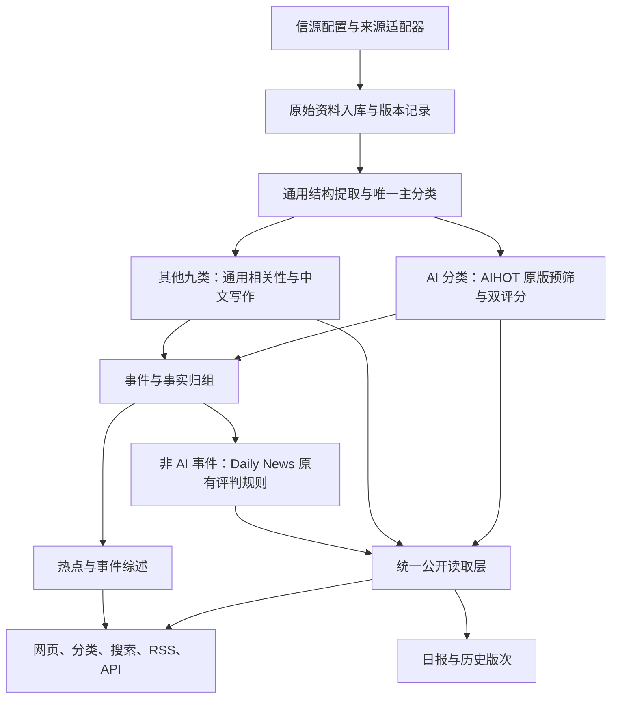

# Daily News 基于 AIHOT 的重构计划

> 状态：**P1–P5 代码已通过 PR #15–#19 合并至 main；P5 有界试运行记录已交付，质量门槛尚未通过**。原批准时间：2026-10-03（Asia/Shanghai）；合并状态复核：2026-10-10（Europe/London），`main=origin/main=7234523ca164b49a0fd3495548adf877ee2b834a`。
>
> 文档 PR #14 已合并至 `ce3f9263c3901839a85794aecea8bc55e67bf0e4`。用户随后明确批准在本对话执行 P1–P5，包括本地有界真实验证；旧“待确认”状态已失效。生产切换、删除旧库、购买采集服务、外部通知和恢复历史监控未获授权。各阶段以实际代码及测试证据更新，不将批准等同于完成。
>
> 后续更新提速方案见 [新闻更新提速计划](news-refresh-performance-plan.md)，该补充计划当前待确认，不因原 P1–P5 批准而自动实施。本文原始版本、实验数据和阶段验收属于带日期的历史记录，不证明当前部署或性能。

## 1. 目标与已确认的决策

以固定版本的 AIHOT 为新底座，形成独立维护的 Daily News。采用它的网页、管理后台、后台任务、事件组织和公开读取体系，将 Daily News 的信源与跨领域编辑规则迁入。本文称新系统为“重构版”；原有 `DailyNewsReport` 已是 V2，文中的“重构版”不代表旧 API 自动升级或兼容。

| 事项 | 2026-10-03 用户决定 | 实施约束 |
| --- | --- | --- |
| 基础架构 | 采用已评估的 AIHOT 版本，再独立重构开发 | 固定完整 commit；不跟随上游 main，不建立自动同步任务 |
| AI 分类评判 | 沿用 AIHOT 默认标准 | 保留该版本 AI 预筛、内容类型、评分提示词、双评分和来源分级阈值 |
| 其他分类评判 | 按 Daily News 原有规则 | 移植现行确定性规则及回归样本，不用新 LLM 提示词替代原算法 |
| 采集方式 | 由实现方按来源迁移 | 原来源准入、禁用状态和阅读链接约束保留；按适配表验证后启用 |
| 全部新闻 | 采用 AIHOT 的公开规则 | 后台原始资料与前台全部动态分开，处理未完成不保证在前台出现 |
| 模型与成本 | 先用 DeepSeek 跑起来实测 | 成本、质量和积压一同记录；没有实测前不承诺日/月费用 |
| 本次执行范围 | 已批准实施 P1–P5 | 分阶段 PR 和本地有界验证；生产切换另行批准 |

以下细化方案已随整份计划获批：保留现有十类；先本地独立 PostgreSQL 试运行；旧系统保留作为回滚目标；历史日报首期保留为旧版归档，不批量重新评分；试运行先用代表信源和有限条目，之后分批扩源。

## 2. 固定基准与证据边界

| 项目 | 固定基准 | 用途 |
| --- | --- | --- |
| AIHOT | `3343fe2b20db4be7269113752d82d3992fc52b6b`，上轮已读取的 2026-10-02 版本 | 网页、后台、任务队列、数据库结构、AI 规则与默认行为的移植来源 |
| Daily News | `8519831714b0d6c8183336c81e8190dceddf7843`，2026-10-03 刷新后的 `origin/main` | 信源、非 AI 编辑规则、分类、偏好和旧数据契约的基准 |

本次核对的是代码与文档，未验证当前线上部署、Cron、数据库容量、DeepSeek 凭据或余额。旧 planning 文档内的来源数量、并发和部署记录是带日期的历史材料；当前实现入口见 [现有架构](../architecture.md)。

导入阶段建议仍使用 Daily News 现有仓库，在独立 `agent/` 分支和 worktree 完成替换，保留现有 Git 历史。先建立旧版本的可恢复 tag/提交清单，再从上述 AIHOT commit 导入所需代码与锁文件，记录来源和文件校验值。保留 MIT 许可证、版权及第三方 NOTICE，站名、图标和对外身份全部使用 Daily News。

原有未完成的 worktree、未提交文件、服务和数据库都不属于重构清理对象。不会在导入时整体覆盖本机工作目录，也不会重用旧生产数据库来试跑 AIHOT 迁移。

## 3. 目标结构与职责

| 模块 | 沿用或改造方式 |
| --- | --- |
| `apps/web` | 沿用 React Router 页面和后台框架，迁入十类导航、中文品牌、事实状态与必要的偏好展示 |
| `apps/api` | 沿用 Fastify、公开 API、后台接口；所有公开出口统一经过 publication 层 |
| `apps/worker` | 沿用常驻 worker 与 pg-boss；采集、提取、评分、归组、成刊分别排队 |
| `packages/backend` | 保留 AIHOT 公共能力，新增分类路由、Daily News 规则适配、选择结果投影和来源迁移工具 |
| `industry` | 保存站点身份、十类体系、来源种子、AI 原版规则副本、非 AI 内容写作规则和功能开关 |
| PostgreSQL | 使用 AIHOT 新库结构，追加本项目迁移；保留原始资料、规则版本、调用回执、发布投影、日报修订 |

网页读取不触发抓取、模型或全量重算。后台失败可重试，已公开且仍有效的内容继续可读；撤回、来源隔离和全文许可继续由同一公开读取层执行。

## 4. 分类与策略路由

### 4.1 十个主分类

保留现有稳定 key：`ai`、`technology`、`finance`、`international`、`china`、`policy`、`society`、`science`、`sports`、`entertainment`。不在本轮另做“主题与地理范围全面拆轴”。

每条资料和每个事件只能有一个用于分类导航的主分类；辅助标签用于说明和搜索，不让同一事件重复出现在多个分类页。国际、国内和政策等交叉归属沿用现行主分类选择逻辑，补齐 fixture 后再接入新模型结构化结果。

AIHOT 原有“模型发布、产品更新、论文/研究”等分类，迁为 AI 的子类型/标签，保留原 `item_type` 和评分类型权重。不能把顶层改成 `ai` 后丢掉原评分所需的七种内容类型。

### 4.2 先路由，再判断是否入选

1. 采集资料保留来源栏目提示，但栏目提示不等于最终分类。综合媒体的非 AI 新闻不能因来源被标记为 AI 就走 AI 评分。
2. 把现有结构提取改成覆盖十类的分类步骤，位于 AI 专用预筛之前；输出主分类、辅助标签、分类依据和版本。优先复用这一步的模型请求，不额外增加一轮重复分类。
3. `primaryCategory=ai` 才调用原版 AI 预筛和双评分；其余九类进入非 AI 流程，绝不先经过“是否属于 AI”的拦截。
4. 材料不足以分类时进入待补材料状态，有限重试，不用“其他类”掩盖失败，不直接删除原文。
5. 分类、原始正文或策略版本改变后，旧策略结果不再作为当前发布依据。受影响资料重新执行必要步骤，完成后原子更新投影，防止旧任务覆盖新结果。

版本签名覆盖完整 taxonomy/标签映射、渲染后的 prompt、实际模型、规则代码版本及适用的来源 tier。AIHOT 基准的 prompt 文件哈希不能单独反映动态分类配置，模型切换也不会自动重判历史，因此新增显式重分类/重评任务；来源 tier 或人工覆盖变更也进入失效清单。首期只重算活跃窗口及明确指定的资料，不自动回填全部历史。

AI 分支的预筛 `BLOCK` 只表示不适合 AI 路由：退回一次非 AI 分类复核；确认属于其他配置领域则转入相应策略，否则保留为明确无关/待处理。限制每个资料版本最多一次回退，避免两条路由循环。`UNKNOWN` 按基准实现继续后续分析，不能简单转成删稿或永久等待；最后能否公开仍由最终相关性、标题/摘要与统一门槛决定。

跨来源报道聚成同一事件后统一事件主分类。辅助 AI 标签不触发第二次精选评判；归组后主分类变化时重算受影响的策略，不允许一个事件同时使用两套规则挑取更高分。人工纠正的分类和事件归属应保留审计记录，并优先于自动结果。

归组作为共享能力采用 AIHOT，但补上自动合并的明确门槛：不同 URL 的同次事件合并建议沿用 Daily News 的保守初值 `confidence >= 0.8`；需要二次复核的路径，两次结论都必须满足关系与置信度条件，否则保留独立记录/相关关系。同 URL 的确定性去重不受此限制。此项是归组可靠性适配，不改 AI 注意力评分；P2 必须覆盖“关系标签是同一事件但置信度很低”的情况，避免只根据标签强行合并。

### 4.3 两套规则的输出契约

建议新增版本化的 `EditorialDecision`（逻辑类型，具体文件名在 P2 落地）：

- 身份：资料/事实/事件 ID、输入 revision、主分类、`policyId`、`policyVersion`、分类版本、证据集版本；
- 公开准备度：相关性 `pass/block/pending`、中文标题/摘要准备状态、失败或排除原因；
- 选择结果：是否入选、原因、原始分数及 `scoreKind`、适用的分级/阈值或 Daily News tier；
- 来源证据：原始报道链接、独立来源、事实状态、推断与估计时间标记；
- 重算依据：评判时间、模型实际名称、prompt 哈希、下一次时效重算时间。

AI 的注意力分与非 AI 的公共重要性分语义不同，不能直接平均或混成统一的“新闻评分”。混合页面按时间和分类分组展示，分数明确标注类型；分类内按对应策略排序。

## 5. 编辑规则的保留与适配

### 5.1 AI 分类：保持基准原意

基准文件为 AIHOT 的 `industry/prompts/prefilter.md`、`selection-score.md`、内容理解提示词、`taxonomy.ts` 和 `selection.ts`。

- 保留 AI 相关性预筛的 `PASS/BLOCK/UNKNOWN` 语义；`UNKNOWN` 是材料不足，不等于明确无关，基准实现会继续分析。跨类回退是新增路由行为，不修改 AI prompt 内的判断标准。
- 保留七类内容类型、五轴评分权重、噪声压制、事实约束和输出契约。
- 同一评分模型独立执行两次评分，以均值判定；门槛保持 `T1=60`、`T1_5=65`、`T2=76`，内容理解分界保持 50。
- 没有适用分级的来源不参加 AI 精选；来源分级在迁移清单中明确填写，不从旧 `credibility` 数字机械换算。
- 原 prompt 的站名变量可以替换为 Daily News；不能把“AI 读者”改成“全领域读者”后仍称其为原版 AI 标准。
- DeepSeek 替换的是执行模型，不代表复现 AIHOT 线上模型的同一评分分布。先记录差异，不因个别案例擅自改默认阈值。

### 5.2 其他九类：移植现行规则

以当前 `src/lib/curation.ts`、`scoring.ts`、`newsOrdering.ts`、`dedupe.ts` 和相关测试为准，抽出不依赖旧服务器/存储的纯函数或兼容适配层。

需要区分两套已有计算：`curation.ts` 决定事件公共重要性、事实状态、编辑层级和集合选择；`scoring.ts` 的兼容条目分与偏好重排另有用途。不能只照搬 `scoringWeights` 就声称保留了非 AI 选题规则。

保留以下语义，并用同输入、同固定时间的差分测试证明：

- 各主分类的公共影响基础分，以及重大事件、政策、公共安全、明确推广等修正；
- 重要性维度、`must_know/important/deep_dive/noise` 层级和体育/娱乐的例外阈值；
- 单源、多源、官方原始材料、未核实、发展中等事实状态；证据不足不被模型写成事实已确认；
- 今日必知、重要进展和持续关注的集合选择、时效窗口、来源/分类多样性与不足时的既有补位规则；
- 个人偏好只影响个人列表，不改公共重要性、事实状态和是否进入全部新闻；
- 来源准入仍在配置时决定，旧 `trust.shouldShow` 不复活为筛选器。

非 AI 不购买两次 AI 注意力评分。DeepSeek 负责分类、中文标题摘要、必要的结构提取与事件判断；原有确定性函数负责非 AI 新闻价值决策。

现行基准数值如下；完整词表和补位细节以固定提交中的原函数为准，不在文档里重新发明实现：

| 非 AI 主分类 | 科技 | 财经 | 国际 | 国内 | 政策 | 社会 | 科学 | 体育 | 娱乐 |
| --- | ---: | ---: | ---: | ---: | ---: | ---: | ---: | ---: | ---: |
| `beatImpactBase` | 44 | 54 | 55 | 58 | 66 | 44 | 48 | 26 | 22 |

- 公共影响按既有词表和事件类型加减，限制在 0–100；总分为 `publicImpact × 0.8 + urgency × 0.2`。`sourceSignificance` 与 `evidenceStrength` 保留为说明字段，不新增到 tier 的公式。
- `must_know`：公共影响 ≥82 且总分 ≥76；`important`：公共影响与总分均 ≥58；`deep_dive`：公共影响 ≥36 且总分 ≥40，或体育/娱乐总分 ≥25；其余为 `noise`。
- 时效：无时间为 45；1/6/12/24/48 小时内分别为 100/90/78/65/42；更旧为 20。时间重算不需要再次调用模型。
- 集合上限：今日必知 10、重要进展 30、持续关注 8；最近 2 小时和 24 小时分阶段优先，同类/同来源通常最多 3，最后不足时按原函数放宽。非 AI 规则测试固定其输入事件集合；AI 加入后带来的全站编排变化单独测试，不宣称新旧混合首页逐条完全一致。
- 单一讨论线索为 `unverified`；至少两个独立 hostname、trust high 或最高来源可信度 ≥80 时为 `confirmed`；其他为 `developing`。该“已确认”是现有来源/证据门槛，不是新增逐事实核验能力；不把类型中未由当前算法产生的状态写成已实现。
- 独立证据的 hostname 身份按旧规则保留；新采集 ID/栏目拆分不会增加票数。若未来要进一步把不同域名合并为同一出版集团，应另做规则变更，不能借迁移悄悄改变非 AI 分数。

兼容条目排序中的 50/20/15/10/5 权重和另一套 `categoryImportance` 用于旧列表与个性化接口兼容，不替代上述编辑基准。屏蔽关键词原来只影响偏好分，并不删除全部新闻，迁移时也保持这个边界。

非 AI 事件规则依赖多条证据，因此在事件归组后执行，并在新增报道、纠错、撤回、主分类变更及时间窗口越界时重新计算。公开读取不承担重算。计算期间允许已满足全部动态条件的资料先公开，精选状态保持待定；新决策按 revision/证据版本提交，随后统一刷新页面、API、RSS 和日报候选。

### 5.3 与 AIHOT 现有字段的衔接

AIHOT 当前以文章分析结果写入 `publications.selected`；Daily News 的核心精选是事件集合级决策。这是本次必要的后端改造，不能只改配置文件。

建议新增独立的策略结果记录及事件决策投影：AI 保留原文章级选择结果；非 AI 保存事件判断与代表报道映射，再由 publication 模块统一生成公开选择状态。来源 tier 对 AI 有阈值意义，对非 AI 不额外加一道 T1/T2 门槛。硬性禁用、isolated、撤回和许可约束对两套策略都有效。

明确粒度与代表稿：旧 `StoryCard` 的一次事件评判对应新模型的 `fact`；AIHOT 的 `story` 用于串起多个进展，不把整条长期事件线压成同一份非 AI 分数。非 AI 每个入选 fact 只指定一条满足公开门槛的代表报道为 `selected=true`，其他有效报道保留在全部动态与证据页。代表选择复用旧优选原稿/证据顺序并加稳定 ID 作平手规则，排除只提及事件的 composite/mention 材料。AI 类继续保留 AIHOT 原文章选择与阅读归组行为。

代表稿替换、撤回或跨类变更时，在同一事务内撤销旧代表的精选投影、选择新代表，并写精选增量账本的 remove/add；无合格替代时只撤销。RSS、API 和精选页读取同一最终投影，事件/事实 ID 保持稳定。已发布日报保存原版次内容及代表 ID；后续代表变更不改写历史，必要纠错创建显式修订。

发布模块、读取契约、后台手动重评、缓存失效、精选增量账本和日报候选查询要一起适配；不能仅改网页的“精选”标识。

## 6. “全部新闻”与产品页面

用户已接受 AIHOT 的定义。重构版“全部新闻”指已进入公开资料池的编辑来源内容，不代表抓到的每一条原始记录，也不等于必须入选精选。

| 状态 | 全部动态 | 精选 | 后台 |
| --- | --- | --- | --- |
| 编辑来源、相关性通过、中文标题摘要齐备、未撤回且到达公开时间 | 显示 | 由该分类的策略决定 | 可诊断和追溯 |
| 相关但低分/未入选 | 显示 | 不显示 | 保留原文与判断 |
| 未分类、最终相关性仍待定、公开所需中文标题/摘要待补 | 暂不显示 | 不显示 | 保留，展示待处理原因和重试状态 |
| 明确无关 | 不进入公开池 | 不显示 | 保留判断与依据 |
| `hot_signal` 来源 | 不作为普通条目显示 | 不显示 | 可贡献热度证据 |
| `isolated`、未准入或已撤回 | 不显示 | 不显示 | 可审计，遵守权限 |
| 新信源首次导入/历史回灌 | 按基准的历史归档行为处理，不冒充今天 | 不产生今日推送 | 标记回灌来源和原始时间 |

“相关性通过”在 AI 类表示原版 AI 相关性；其他九类表示落在 Daily News 已配置领域，不能统一解释成 AI 相关。执行时复用 AIHOT 的 `eligible`、`visibility`、release gate 和全文许可规则，并对所有公开出口做一致性回归。

上表的“最终相关性待定”不等于 AI 预筛的 `UNKNOWN`，后者会继续分析。缺完整正文也不是独立的公开禁令：如果基准处理已经得到有效相关性、中文标题和摘要，就按正常规则判断，避免比 AIHOT 新增更严的全文要求。

页面以 AIHOT 的精选、全部动态、热点、日报、事件详情与后台为基础。分类导航使用十个主分类；保留原文链接、来源中文名、时间、选择理由和事实状态。偏好设置迁入兼容读取层，旧数据无法解释时明确使用默认值，不影响公共榜单。

建议首期热点使用 AIHOT 的统一独立来源热度算法；公共重要性仍只由各分类规则判断。日报保留上海时间 08:00 截止、不可被实时卡片静默改写的版次语义，采用十类分节；建议保留现行最多 24 个事件、实际有合格事件的分类优先获得位置。AI 日报候选使用 AIHOT 入选结果，非 AI 候选保留原日报的非 noise 等条件，并共同满足新的公开门槛。不同策略分数不直接混排，跨类名额先覆盖分类，再按类内顺序轮转，最终按时间编排。

上述热点统一算法与日报混合编排是本计划的产品适配建议，不属于“AIHOT 默认 AI 评分标准”的改动。周报/月报、RSS、公开 API 和 MCP 沿用已有能力并做回归；模型榜、Codex 重置监控关闭，飞书推送和 IndexNow 默认不开启。

## 7. 信源迁移方案

首先生成逐来源、逐栏目清单，使用稳定映射 `legacySourceId + sectionId → newSourceId`。同一个发布者可能有多个栏目；采集 ID 拆分不能把同一媒体变成多个独立证据或多张热度票。保留原来源 ID、旧证据 hostname 和新发布者标识：非 AI 证据与多样性使用原有身份口径，新热点按统一发布者去重，不能直接拿新采集 ID 计数。

| 原有方式 | 首选目标 | 需要验证的差异 |
| --- | --- | --- |
| RSS / Atom / RSSHub | AIHOT `rss` | feed 主机、读者链接别名、时间、正文/摘要、ETag、重复 URL |
| 可直接解析的栏目页 | `web_list` | 每条新闻选择器、相对链接、日期与详情补齐，不把导航当新闻 |
| JSON / 官方公开接口 | `json_list` | 字段映射、分页、允许域名；不把凭据写入种子配置 |
| News sitemap | 保留解析能力，作为独立来源任务接入 | 新闻时间与 lastmod 区别、目录索引、分区范围、幂等导入 |
| Firecrawl keyless 补抓 | 迁移为有界 fallback 适配器 | 仅在直连失败/无有效结果时补充；不把静态示例灌进在线池 |
| 官方 X 用户时间线 | 保留现有官方 API 适配及 cursor 语义 | 不默认换成 SocialData；无凭据时停用该来源并标明原因 |
| 特殊公开页面 | 小型专用适配器或 `external` 导入 | 同样经过来源约束、原始资料入库、正文版本和处理队列 |

优先在新 worker 内运行来源适配器，不长期维持两套完整后端。如果短期通过 `/api/ingest/items` 桥接，要求本地调用、批次幂等、显式建立来源，确认其默认隔离状态；只有成功持久化后才推进 cursor。接口不足以承载元数据时扩展契约并测试，不直接写业务表绕开 material/publication 模块。

迁移清单至少记录：旧/新 ID、发布者、主分类提示、语言、入口、允许主机/路径、来源角色、AI tier、启用/准入状态、读者可访问性、全文许可、迁移方法、试抓输出、失败原因、最后验证日期。

AIHOT 的 `industry/sources.json` 只用作新库种子；已有 ID 不会被 seed 覆盖。后续配置变更通过后台或显式的幂等迁移工具完成，有差异预览和审计，不假设修改 JSON 就更新线上配置。

保留 Reuters、Bloomberg、FT、WSJ、The Athletic 的现有禁用状态，以及其余未获准/暂缓来源。X、公众号、Jina 等额外付费采集不因模板支持就自动启用。本轮来源授权来自原有清单，不增购服务。

## 8. 数据、接口与运行环境迁移

### 8.1 新旧库隔离

本地验证采用独立 PostgreSQL 数据库和独立卷，使用 AIHOT 基准 migrations，再追加分类策略、来源映射和决策版本迁移。旧 Supabase 库继续按旧系统工作，不能对它直接运行 AIHOT schema，也不把 Supabase RPC 名称和权限原样拷进普通 PostgreSQL。

| 数据 | 首期处理 |
| --- | --- |
| 来源与栏目配置 | 转换、校验后导入；保留旧 ID 对照、禁用原因和主机约束 |
| 最近的原始候选 | 小批可追溯导入，标记回灌；需要新策略的内容重新处理，不伪造评分结果 |
| 原快照、已发布日报 | 导出原始记录与校验清单，保持不可变；首期通过旧版归档保留，不自动全文重评 |
| 旧 lease、Cron、run metrics | 保留为旧系统运行记录，不迁成 pg-boss 活跃任务 |
| 来源 cursor | 按适配器兼容性单独迁；无法证明兼容时用有界回看加 URL 幂等，不盲拷游标 |
| 浏览器偏好、收藏/已读 | 实施时盘点真实存在字段，设计一次性有版本转换；没有旧数据的能力不宣称已迁移 |

导出需记录行数、ID 范围、原始时间、文件校验值与导入结果，并在隔离库验证抽样读回。备份与迁移是两件事；若实际有 Storage/本地附件，要另外盘点文件对象，数据库备份不等于附件备份。实施时重新核对 Supabase/pg_dump 版本与官方导出方式，当前不执行导出。[Supabase 备份边界](https://supabase.com/docs/guides/platform/backups)

### 8.2 API 与 URL

新网页以 AIHOT 的 site API 为内部契约，对外使用其 `/api/v1/*`、RSS、事件和日报入口。旧 `/api/news` 不天然兼容新架构。

P1 盘点旧 API 的真实调用者，P4 实现过渡适配器：保留已使用的只读字段，明确新“全部新闻”门槛和策略分数字段；无法无损表示的字段不能补假值。旧消费者迁移完成前保留旧版本服务或明确的兼容响应。旧 refresh/cron 路由不能无鉴权映射到新 worker 管理入口。

保留外链、事件/日报旧 ID 映射与必要的重定向。公开出口的撤回、全文许可、分类和选择结果保持一致，浏览器和 API 均不获取服务端 key。

### 8.3 运行方式与切换

首轮本地使用 Docker Compose 的数据库、setup、api、worker、web，选取未占用端口；Node 与依赖先遵循固定基准，后续依赖修复单独提交。开发安全阀和模型/采集开关按阶段开启，避免 `init-env` 默认启用外部调用。

P1 同时适配 CI：新 monorepo 使用对应 Node、PostgreSQL、迁移和测试流程，不继续套用旧 Vite/Supabase 的命令。先盘点仓库与 Vercel 的自动部署关联，重构分支的提交、文档确认或测试通过不能触发现网替换；正式切换前使用独立验证环境并保留旧部署可恢复版本。

生产服务器、域名和长期预算在本地试运行后确定，不在本轮采购或部署。目标是能运行常驻 worker 的环境；现有 Vercel 定时函数不能直接承担原样的 pg-boss worker。

未来发布顺序：记录旧部署与数据备份 → 新环境验收与初次迁移 → 停止旧写入调度并等待在途任务完成，记录确定的 cursor/提交水位 → 导入并核对最终增量 → 切换流量并开启新调度 → 读回真实页面/接口。冻结至切换期间以原始时间作有界回看补采，幂等合并。切换失败则停止新调度、恢复旧版本与旧调度，核对时间窗口并有界补采。旧库、旧版本和备份保留到新系统验收完成；具体生产切换另行批准。

## 9. DeepSeek 试运行与成本观察

采用 AIHOT 的 OpenAI-compatible `default` 模型入口，配置 `LLM_BASE_URL`、`LLM_MODEL`、`LLM_API_KEY`。实际模型名在试运行前通过当前官方文档/可用模型核实并写入运行记录；本计划不把仓库里的预设别名当成供应商当前可用性的证明。

首期所有文本能力可先用同一个 DeepSeek 模型：分类、AI 预筛/双评分、中文写作、归组、综述与日报。归组复核若仍使用同一模型，要标为同模型第二次判断，不能称为不同供应商交叉验证。向量服务不是聊天接口的必然能力；未配置 embedding 时使用基准已有的其他召回路径，并单独检查漏并，不擅自购买第二家服务。

建议先用 10–15 个代表来源和 100 条新增资料验证，覆盖 AI、科技、财经、国际/国内、体育及中文/英文，且包括 RSS、网页、sitemap。成功后扩展到 200 条标注样本，其他分类通过 fixture 和后续分批实源测试补齐。首次历史导入和正常增量分开计量，不以回灌刷出的调用量推算日常费用。

新信源首轮内容会按基准标记为回灌；真实“今天”和日报验收需要后续正常增量，不能通过删除回灌标记、改原文时间或写示例数据伪造活跃结果。

建议初始采集并发 4、模型处理并发 2；模型服务预算先设每分钟 20 次、每小时 200 次、每天 1,000 次，达到限额暂停并保留待处理队列。先处理 100 条新增资料，不因额度恢复自动扩大样本；第二批依据实测记录再启动。预算必须显式存在，禁止“缺预算记录即不限额”；实现前先完成配置与熔断测试。以上是拟议试运行参数，随计划确认，后续调整记录前后值。请求次数上限不等于人民币硬上限，价格和 tokens 必须另外记录。

每一轮交付以下观察表：

- 来源实际尝试、成功、失败、未启用及其原因；新增资料、重复、公开、精选和 pending 数量；
- 各步骤调用次数、input/output/cache tokens、重试、已复用回执和未知回执；
- 供应商、准确模型版本、价格日期、账单币种、估算成本与账户实际扣费差异；
- 每 100 条新增资料成本、每条公开/精选成本、从入库到公开的 P50/P95 延迟、队列积压；
- AI 误筛/漏选、非 AI 规则一致性、分类错误、错并/漏并与摘要事实错误。

费用按实际模型的分类 token 单价计算，不能只用“调用次数 × 平均价格”。遇到余额不足、预算熔断或模型失败，展示积压并停止扩源，不切换到未经配置的新服务。P0 制定计划时尚未调用模型；P5 已在批准范围内核实模型与价格并使用既有 DeepSeek 凭据进行有界试运行，实测与未达标项见 [P5 记录](../p5-bounded-trial.md)，不构成长期预算承诺。

## 10. 分阶段实施与交付

P0 已获用户批准；P1–P5 的 PR #15–#19 已于 2026-10-03 合并，最终主干提交为 `7234523ca164b49a0fd3495548adf877ee2b834a`，该状态于 2026-10-10 通过 Git 和 GitHub 复核。以下是 2026-10-03 的历史验收：P1–P4 本地离线和代码 CI 通过；P4 包含 618 项后端测试、31 项 smoke 及 Chrome 主流程；P5 新空库 634 项后端回归通过，有界真实运行生成 24 条日报后关闭，样本为 31 条正常新增和 20 条历史资料。100 条正常新增目标与 200 条人工标注未达到，视频提取及派生标题限定语仍有质量缺口，不能宣称通过质量门槛；详见 [P5 记录](../p5-bounded-trial.md)。本次未重跑这些产品检查或试运行。P6 生产切换尚未授权；代码已合并不等于新版已部署。后续改动仍按阶段提交可 review 的 PR，未经合并授权保留 PR。

| 阶段 | 工作与交付物 | 出口条件 |
| --- | --- | --- |
| P0 计划确认 | 确认本文已定方向与细化建议；冻结两边 SHA | 用户明确批准实施 |
| P1 基准导入与离线启动 | 记录许可证/来源；导入基准；独立 DB/卷/端口；Daily News 品牌；关闭 AI 专属模块；盘点来源、旧 API、旧数据 | 无外部采集/模型时，类型、构建、基础测试、迁移和网页 smoke 通过 |
| P2 分类与两套策略 | 十类、AI 子类型；分类前置；AI 原规则固定；非 AI 纯函数及适配；事件决策/发布投影；策略版本与失效机制 | AI 规则快照、非 AI 差分测试、跨分类事件与异步一致性测试通过 |
| P3 来源迁移 | 逐来源清单、发布者标识、RSS/网页/JSON/sitemap/Firecrawl/X 适配；cursor、幂等和失败隔离 | 代表来源样本字段正确；禁用来源与无 key 付费来源零请求；所有旧配置均有去向 |
| P4 产品与公开出口 | 分类、精选、全部、热点、日报、事件详情、后台；偏好/API/旧链接过渡；撤回与许可联动 | 浏览器主流程和 API/RSS/日报投影一致，旧接口兼容边界可核对 |
| P5 有界真实试运行 | 开启代表信源和 DeepSeek；固定样本/评测表；一次故障恢复与日报生成；分批扩大来源 | 得到真实质量、调用/成本、延迟、积压和失败明细，未达标项有结论 |
| P6 切换准备 | 旧库导出与恢复验证；历史归档/增量；生产部署、调度与回滚清单 | 用户审核试运行结果并批准生产切换；本计划批准不自动执行此步的线上切换 |

P1–P5 不删除旧系统；P3 的配置解析和 fixture 可与 P2 并行，真实采集必须使用已验证的隔离环境和限额。预计工作量主要在 P2/P3 的规则和来源适配，不能承诺仅修改 `industry/` 即完成。

## 11. 验证与验收

### 11.1 离线回归

| 维度 | 必须证明 |
| --- | --- |
| AI 规则 | 原 prompt/类型权重/阈值有固定快照；两次独立调用；T1/T1_5/T2 边界；UNKNOWN、缺正文、攻击性原文不能越权 |
| 非 AI 规则 | 同输入、同时间的基准 fixture 输出一致；公共重要性、tier、事实状态、精选集合、偏好次序逐项对照；公开门槛改变单列，不当成规则回归失败 |
| 分类与归组 | 十类都覆盖；综合媒体不被来源标签强制归类；AI BLOCK 可回退非 AI 且不循环；同事件多类归一；低置信度不强并；主分类变更失效旧决策；人工纠正不被覆盖 |
| 异步一致性 | 新证据/撤回/时效越界会重算；过期任务不能覆盖新 revision；重启可恢复；重复任务不重复公开；未知付费回执不会无限重发 |
| 采集 | feed/网页/sitemap/JSON/X 的固定样本；域名与重定向限制；重复 URL；失败不推进 cursor；同媒体多栏目不增加独立票 |
| 公开契约 | 最终 pending/blocked 不出现在全部动态；未入选但 eligible 可以公开；非 AI 唯一代表稿替换/撤回与增量账本一致；所有出口一致撤回；全文默认受许可控制 |
| 日报 | 上海 08:00、窗口边界、唯一事件、分类覆盖、无合格稿不填数、版次冻结与显式修订 |
| 运维 | 预算熔断、缺 key、provider 超时、数据库暂时不可用、停止重启、备份读回与回滚演练 |

沿用 AIHOT 基准实际提供的检查：`npm run typecheck`、`npm run build -w @aihot/web`、`node --test apps/web/tests/*.test.ts`；后端测试前先在名字以 `_test` 或 `_ci` 结尾的隔离空库执行 `node scripts/migrate.ts`，再运行 `npm test`；启动无外部调用的服务后执行 `node scripts/smoke.ts --base <本地地址>`。未来仓库命令变更时同步文档，不混用当前 Daily News 与新基准的命令。

历史文档 PR #14 的 app-tests 与 database-tests 已通过，Vercel 为 Account is blocked；用户仅对该文档 PR 授权忽略该状态。实施阶段必须重新执行相应代码检查，不能沿用文档 PR 的验证结论。

### 11.2 真实样本与可衡量指标

建议以 200 条经人工核对的资料构建验收集，其中 AI 至少 50 条，其余九类每类至少 10 条，另覆盖跨类、材料不足、明显无关、重复和后续进展案例。机器预标注不能代替人工确认的基准答案。没有标注集时可先跑通链路，但不能宣称精选准确率达标。

建议门槛（供本计划确认）：

- 非 AI 确定性规则差分测试 100% 一致，允许差异仅限明确记录的新公开门槛/统一展示适配；
- 主分类准确率 ≥95%，AI 相关性误拦截率 ≤5%；AI 精选 precision/recall 均报告，不先通过改原默认阈值追求数字；
- 人工验收集中无严重错并、无新增关键事实、无错误来源归属；同时报告漏并，不能只测两个已选候选的关系判断；
- 迁移清单覆盖 100% 旧配置，状态明确为已验证/保留禁用/待凭据/适配失败，不以后台有记录代替实际可采集；
- 试运行中每个启用代表来源至少实际执行一次；有新闻与零新增都留下结果，不承诺任何网站的文章零遗漏；
- 有一次受控失败重试、一次 worker 重启恢复、一次真实版次生成；调用与费用有可核对记录；
- 页面打开触发的模型调用为零；预算到顶停止新付费请求，既有公开内容可读；外部推送保持关闭。

AI 精选质量如明显不适合所选 DeepSeek 模型，先列出错误样本和成本/模型参数证据，提交调整建议，由用户决定是否改变原版阈值或模型。不能以原版规则已保留代替效果验收。

这是新版本的有限功能试运行，不恢复已取消的历史 24 小时 burn-in、七天 soak、旧 observer 或 heartbeat；不创建定时监控任务。

## 12. 风险、确认点与非目标

| 风险 | 应对 |
| --- | --- |
| 分类先后顺序错误导致非 AI 被挡掉 | 分类路由先于 AI 预筛，跨分类 fixture 与公开数量对账 |
| 把旧规则改成模型意见 | 保留确定性函数，差分测试锁定算法而非仅比文案 |
| 文章级 AI 决策与事件级非 AI 决策冲突 | 独立 policy 结果、事件投影、版本校验；不混用分数尺度 |
| 同媒体拆栏目后虚增多源证据/热度 | 显式共享发布者 ID，聚合和多样性统一使用 |
| 即使模型单价较低，多次调用/重试仍可能形成积压或费用 | 有界样本、并发、服务预算、回执复用、真实 tokens/费用记录 |
| AIHOT 基准不含原站完整信源和运营数据 | 以 Daily News 清单为准，逐项验证，不假设开源配置代表线上效果 |
| 固定基准后缺少上游修复 | 自行维护依赖和安全修复；不依赖自动同步，但保留来源可追溯性 |
| 迁移期间出现历史丢失或重复处理 | 新旧库隔离、备份与ID映射、明确回灌、cursor幂等、切换回滚 |

整份计划已获实施批准，包括本地独立 PostgreSQL、统一热点与混合日报、首期旧日报归档、试运行样本和验收指标。已明确的 AI/非 AI 评判分工、全部新闻定义、DeepSeek 优先和固定代码基准不再列为未决定事项。

生产服务器/域名、历史归档最终入口、长期费用上限以及付费来源凭据，在对应阶段准备好具体方案后再确认；这些不阻塞已授权的本地开发。凭据缺失时记录依赖并继续离线工作。

本计划不包括新来源采购、用户账户系统、外部通知发送、自动上游同步、全站视觉重设计、删除旧数据库、恢复历史监控或立即生产部署。

## 13. 主要实现依据

本地当前实现：

- [来源与栏目](../../src/config/sources.ts)、[扩展来源](../../src/config/expandedSources.ts)、[X 账号](../../src/config/xAccounts.ts)、[类型与分类](../../src/types.ts)。
- [事件选题与日报](../../src/lib/curation.ts)、[兼容排序](../../src/lib/scoring.ts)、[页面次序与偏好](../../src/lib/newsOrdering.ts)、[事件归并](../../src/lib/dedupe.ts)。
- [采集与中文处理](../../scripts/newsService.ts)、[刷新编排](../../scripts/newsRefresh.ts)、[X 增量采集](../../scripts/xSource.ts)。
- [现有技术架构](../architecture.md)、[现有运行手册](../runbook.md)。

固定 AIHOT 基准：

- [架构](https://github.com/KKKKhazix/AIHOT/blob/3343fe2b20db4be7269113752d82d3992fc52b6b/docs/architecture.md)、[定制说明](https://github.com/KKKKhazix/AIHOT/blob/3343fe2b20db4be7269113752d82d3992fc52b6b/docs/customize.md)、[来源类型](https://github.com/KKKKhazix/AIHOT/blob/3343fe2b20db4be7269113752d82d3992fc52b6b/docs/sources.md)。
- [默认 AI 评分提示词](https://github.com/KKKKhazix/AIHOT/blob/3343fe2b20db4be7269113752d82d3992fc52b6b/industry/prompts/selection-score.md)、[阈值](https://github.com/KKKKhazix/AIHOT/blob/3343fe2b20db4be7269113752d82d3992fc52b6b/industry/selection.ts)、[分析流程](https://github.com/KKKKhazix/AIHOT/blob/3343fe2b20db4be7269113752d82d3992fc52b6b/packages/backend/src/editorial/analyze.ts)。
- [公开门槛](https://github.com/KKKKhazix/AIHOT/blob/3343fe2b20db4be7269113752d82d3992fc52b6b/packages/backend/src/publication/rules.ts)、[发布投影](https://github.com/KKKKhazix/AIHOT/blob/3343fe2b20db4be7269113752d82d3992fc52b6b/packages/backend/src/publication/publish.ts)、[日报编排](https://github.com/KKKKhazix/AIHOT/blob/3343fe2b20db4be7269113752d82d3992fc52b6b/packages/backend/src/reports/compose.ts)。
- [模型路由](https://github.com/KKKKhazix/AIHOT/blob/3343fe2b20db4be7269113752d82d3992fc52b6b/packages/backend/src/editorial/models.ts)、[预算与回执](https://github.com/KKKKhazix/AIHOT/blob/3343fe2b20db4be7269113752d82d3992fc52b6b/packages/backend/src/providers/receipts.ts)、[部署](https://github.com/KKKKhazix/AIHOT/blob/3343fe2b20db4be7269113752d82d3992fc52b6b/docs/deploy.md)。
