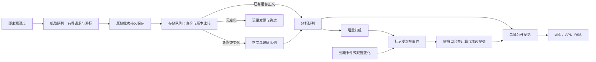

# 新闻更新提速计划

> 状态：**计划中，待用户确认；尚未实施或测得优化收益**。核对日期：2026-10-10（Europe/London）。
>
> 本文补充 [AIHOT 重构计划](aihot-v2-refactor-plan.md)，只解决更新延迟和重复处理开销。目标是在已合并的 AIHOT 底座上做好跨行业新闻流水线，保留十个主分类、已批准的 AI/非 AI 策略分工和公开门槛。信源扩充另做；本轮不启用采集、调用模型、修改运行配置或部署。

## 1. 结论与范围

建议以新版 `apps/* + packages/backend` 为唯一长期优化对象。旧版用作入口核对和性能参照，不再给旧版建设第二套完整队列。新版已具备 AIHOT 的文章身份、内容版本、分阶段任务与增量文章发布；主要缺口在 Daily News 的全局精选重算、无变化资料的数据库开销，以及单来源内部详情抓取与存储的串行等待。

优先解决四件事：记录完整延迟；无变化内容尽早退出；快来源、快文章独立前进；昂贵的事件计算按变化和时间边界触发，再合并更新精选。提高并发只是后续调参，不能先用更多请求掩盖重复工作。

**当前生产运行哪一版尚未核实。** 如果用户看到的仍是旧部署，新版代码优化不会自动改变线上速度。实施第一步必须读回部署提交、进程入口、调度、启用来源与数据库归属；生产切换仍按原计划单独批准。仓库 `vercel.json` 目前关闭 Git 自动部署，不以主干已合并或旧站 HTTP 200 推断新版在线。

不在本计划内：扩充/重新启用信源、替换非 AI 编辑规则、改十类分类体系、增加付费供应商、提高长期费用额度、自动跟随上游、重启已关闭的 P5 试运行或历史监控、删除旧库。

## 2. 本次确认的三个入口

| 对象 | 核实的代码入口与流程 | 使用边界 |
| --- | --- | --- |
| 旧版 Daily News | 旧包清单的 `npm run api` / `serve` → `scripts/newsServer.ts` → `newsRefresh.ts`；Vercel `api/refresh.ts` / `api/cron.ts` 也进入旧刷新流程；`generateDailyNews.ts` 生成静态 JSON | 这些 npm 命令属于旧清单，不能直接拿当前根 package.json 启动旧版。基准实验使用固定旧提交和隔离依赖、数据 |
| 当前新版 Daily News | 根 `npm run dev:api`、`dev:worker`、`dev:web`；构建后分别运行 `apps/api/src/main.ts`、`apps/worker/src/main.ts`、`apps/web/server.ts`。worker 注册持久队列，API/web 从 publication 层读取 | Node >=24.11；独立 PostgreSQL；采集与模型开关默认关闭。常规 worker、有界试运行和手工 CLI 的调度不同，须分别记录 |
| 固定 AIHOT 原生 | 相同 web/api/worker 架构；pg-boss 分开抓取、正文提取、分析、归组和摘要任务 | 同一 worker 消费多种队列；并非三个独立服务，也没有独立的存储队列。只对比固定源码，不声称它的线上速度来自这些代码 |

版本证据：本次 `git fetch origin --prune` 后，规范 checkout `main` 与 `origin/main` 均为 `7234523ca164b49a0fd3495548adf877ee2b834a`；GitHub 查询确认 PR #15–#19 已合并。旧版固定为 `8519831714b0d6c8183336c81e8190dceddf7843`；上游固定为 `3343fe2b20db4be7269113752d82d3992fc52b6b`，已重新取得源码并核对 SHA。

本机抽查旧/新默认及历史预览端口 4173、5173、3300、3301、3310、3311 时未发现监听；这只是一组本地端口的检查，不证明其他端口或生产没有服务。本轮未启动服务或数据库，未跑性能实验。

特别注意：`scripts/collect.ts` 是按来源逐个 `await` 的手工 helper，并已输出每源 `ms`；它不能代表正常 worker 的多来源并发性能。有界试运行也只允许指定来源和队列，不能为了测速取消其限额。

## 3. 源码对比与瓶颈假设

| 环节 | 旧版 | AIHOT 原生与当前新版 | 本计划判断 |
| --- | --- | --- | --- |
| 来源完成屏障 | 并发抓取后汇总全部来源，再做 enrichment、构建整份报告 | 两者已有来源级任务，快源可以先进入后续队列 | 不重建已有队列；旧版的全轮等待仅作参照 |
| 提前去重 | 单栏目/整轮 URL 去重、持久候选比较；语义判定目标已限制为新增或变化项，但常规聚类和评分仍遍历候选池 | 两者在详情前批内身份去重；持久 `identity_key`、正文 hash、revision 决定是否分析，RSS 已支持条件请求/304 | 承认已有能力，补批量已知内容查询、减少无变化写入/锁竞争、补可靠的更新发现 |
| 单来源处理 | 抓取后仍有翻译等等待 | 两者都先逐条 `fetchDetail`，结束后逐条 upsert 和入队；当前 `collect.ts` 233–270 行可见此顺序 | 新稿在同来源内也会等待慢详情，增加持久交接与小批写入 |
| 发布 | 对候选池整体聚类、评分、生成报告，再原子提交快照 | 原生正常路径是单文章 publication 更新；当前 `publish.ts:434` 默认接着调用全局 `reconcileEditorialPoliciesTx` | **最高优先级实测对象**：每篇发布导致全事件读取、校验和非 AI 重评 |
| 锁竞争 | 整轮刷新租约防止并发提交 | 当前每篇发布持有 `dailynews-editorial-projection` 锁；重复资料在判断 hash 相同前也获取此锁 | 即使无新增也可能阻塞发布；需把无变化路径移出全局投影锁，同时保留并发一致性 |
| 定时重算 | 以整轮刷新为中心 | 当前每分钟全局非 AI 重评、每五分钟扫描活跃分析签名/热点等 | 按变更和 `next_reevaluation_at` 执行重评，保留有界校准 |
| 超时/重试 | 请求与来源截止时间、有限重试已存在 | 两者有请求超时、任务过期、业务退避；普通 fetch job `retryLimit=0`，失败主要等下一次来源调度 | 不能把 pg-boss 过期等同于取消网络/计算；补来源总截止时间与分类重试，不叠加无限重试 |
| 耗时/数量 | 来源 diagnostics、部分处理计数已存在 | `fetch_runs` / `job_runs` 已有开始结束时间与结果；手工 CLI 有总 ms | 补齐阶段耗时、排队等待、修改/跳过数和读者可见时间，不重复建设日志系统 |

上述是代码层事实与瓶颈假设，**不是当前线上慢因的实测结论**。上游默认分析并发 6，当前新版默认 2；这是影响吞吐的变量，但提高到 6 需先测数据库、模型预算和限流，不能直接照搬。

另有两类正常等待须拆开测量：来源调度间隔，以及精选发布门槛/HTTP 缓存。当前来源适应间隔常见为 15–60 分钟，付费或热度来源可能更长；精选默认等待归组完成或最多 180 秒，公开 API 的缓存又与网页不同。处理提速不等于自动缩短发现时间，也不能把“全部动态”和“精选”的可见时间混为一项。

## 4. 目标数据流

沿用 PostgreSQL + pg-boss，不新增 Redis/Kafka 或第三方遥测。抓取、存储、正文、分析分别有并发上限；队列交接持久化。首次实现仍可由一个 worker 运行，后续是否拆进程由负载证据决定。

## 5. 实施阶段

### S0：入口核对、统计和优化前基准

先做观测及可重复实验，再动算法。新版为主要优化前基线；旧版仅跑固定样本回放/阶段观测，不修改其线上调度和发布行为。

- 每次刷新/来源运行记录 `runId`，每批次、文章版本与任务能关联。所有时间记 UTC，报告显示时注明时区。
- 耗时分别记录：调度迟到、抓取、详情/正文、入库、排队、分析、归组、事件计算、精选提交、数据库锁等待、首次公开、批次完成。阶段用单调时钟计时；持久时间戳用于跨进程关联。
- 数量分别记录：返回、过滤、批内重复、持久未变化、新增、修订、待正文、待分析、归组输入/比较次数、重算事件、SQL 次数/影响行数、发布变更、重试、失败及预算等待。无变化资料不得被计为“分析完成”或“成功更新”。
- 复用 `fetch_runs`、`job_runs` 和 provider receipts；新增最小阶段记录/结构化日志，只存 ID、计数和耗时，不存凭据、完整正文或外部追踪数据。指标需区分当前阶段的工作耗时和排队时间。
- 分别计算“来源发布时间→发现”“发现→全部动态公开”“发现→精选可见”“后端已公开→页面/API可见”。来源时间缺失或不可靠的样本单列；统计 P50/P95、队列最老等待和吞吐，不能只报整轮完成时间。
- 读取当前部署提交和真正服务入口；如果生产证据不可访问，保留待确认，不用旧文档替代。记录实际开关、来源数、调度间隔、缓存策略与 worker 存活情况，但不输出环境变量值。

出口：同一 fixture 可得到阶段耗时/数量表；重复运行能定位开销，而非只有“本轮花了多久”。冻结优化前实验结果和硬件/配置，暂不承诺倍数。

### S1：把无变化内容拦在昂贵处理之前

主要范围：`sources/collect.ts`、`content/materials.ts`、`jobs/content.ts`、相关正文提取及测试。

1. 保留当前规范化 URL/平台 ID、跨来源发现记录、fragment 特例和唯一约束；身份去重不能替代跨媒体事件归组，同一事件的不同报道仍保留为证据。
2. 在一个受控批次中查询已存身份、来源和相关摘要字段，区分 `new / changed / unchanged / needs_recheck`；不要为每个旧条目先抢全局发布锁再判断无变化。
3. 无变化路径只补必要的发现记录/来源状态，不重抓正文、不重分析、不重归组、不重建精选。此前失败的未完成任务由恢复队列继续；规则/模型签名变化和人工重评属于明确例外。
4. 真正的修订路径保持统一锁顺序、行锁和提交时版本校验。无锁预读只是优化提示，不能覆盖并发写入，也不能让旧结果写回新 revision。保持当前新版精选失效与 remove 账本原子提交。
5. 不能永久跳过已知 URL：对可信 `updatedAt`、列表内容变化或条件请求表明有修改的文章安排正文复查；正文变化但列表不变时，提供活跃时间窗内有预算的抽样/周期复查。先明确适配器信号，再调整策略；不每轮重抓全部历史文章。
6. 区分内容版本与仅来源/许可/分类规则变化：后者只失效相关派生结果；不要为了规则变化伪造正文 revision。列表噪声、历史 hash 轮换和可信来源纠错回退分别测试。

出口：无变化重复刷新不新增内容 revision、模型请求和归组任务；单篇更新仅重算该版本及受影响事件，同时不会漏掉有证据的正文修订。

### S2：抓取、存储、分析分别排队

主要范围：`jobs/queue.ts`、`jobs/sources.ts`、`sources/collect.ts`、`jobs/content.ts`、worker、独立 PostgreSQL 增量迁移。

- 新增轻量持久接收批次与存储任务（拟命名 `collection.store`）：抓取结果分块保存，队列只携带批次 ID；正文/大响应不复制进 pg-boss payload。批次保存和存储任务入队在同一事务提交。
- 来源运行记录抓取完成、已接收/已保存批次数及候选数。只在该次返回的全部候选已完成持久处理后推进成功 cursor/ETag 和 `last_ok_at`；尚有未处理尾部时不能接受 304 并把尾部丢掉。分析完成不作为推进抓取 cursor 的条件。
- 每个批次幂等；文章写入、允许的试运行准入记录、下游任务/outbox 原子交接。保留现有 `upsertMaterial + admitArticle` 原子边界和 frozen/quota 拒绝语义，所有新队列纳入 trial allowlist。
- 列表发现先持久化；需要详情补日期/标题/正文的文章进入正文/详情阶段。每篇按自己的材料完成后分析，同来源的快文章不再等待全部慢详情。缺少权威日期/必要正文时仍须按现有公开门槛处理，不能提前发布不合格稿。
- 优先服务新增新闻，历史回填和周期复查低优先级；为来源/域名限制并发并轮转派发，防止一个大来源或大量慢域名占满抓取/正文槽位。存储、正文、分析积压达到高水位时减缓上游，恢复到低水位再放行；不得通过丢尾部减轻积压。
- 来源总截止时间与单请求超时都使用可取消信号；未完成分页/批次留可恢复状态。区分暂时网络错误、429/5xx、永久配置/权限错误、预算等待；暂时失败有限退避加抖动，尊重 Retry-After。HTTP 与业务重试共享有界尝试次数和截止预算；pg-boss 过期只是最后的看门狗，处理器仍须用 AbortSignal 取消请求，外部请求期限须早于任务期限。
- 抓取成功但进程在入库前重启：从持久批次续跑；批次未保存：允许重新抓取；文章已提交但消费者重启：按相同版本恢复并复用已确认的调用回执。供应商已处理但本地尚未保存结果时，进入 unknown，按既有受限、有审计的 receipt release 流程核验后恢复，不盲目重发；数据库事务不能保证供应商在所有故障点都只计费一次。两次来源任务并发时必须有来源级租约/运行序号，旧任务不得覆盖较新的 cursor。

初始实验参数：抓取沿用当前 8、分析沿用 2、正文沿用 4；存储先 1–2 个消费者，每批最多 50 条。它们是待 S0 实测调整的配置，不是吞吐承诺；有界试运行继续服从自己的固定并发/预算。优先复用现有队列和恢复器。

出口：快来源能在慢来源结束前公开；同来源的快文章也能先进入分析；中断可恢复，重复重试不重复建稿或生成通知任务，已确认回执不重复调用，未知回执不盲目重发。

### S3：批次提交精选，增量计算受影响事件

主要范围：`publication/editorial.ts`、`publication/publish.ts`、`publication/reprocess.ts`、`dailynews/non-ai.ts`、`events/*`、管理写入入口与 schedules。

**不能简单只对 changed fact 调用现有筛选函数。** 非 AI 的 `selectCore` 有全局前 10/重要 30、时效分段和来源多样性约束；一个新事件可能挤掉另一个未修改事件。因此拆成两层：

1. 事件材料层：按受影响事件重建有效证据、分类、代表稿、公共影响和时间特征，保存输入版本/策略签名；未变化且未到期的事件复用结果。分类签名校验批量读取，避免每次逐文章重复查询。
2. 全局选择层：使用这些缓存特征按当前规则选出集合，每个批次最多执行一次；只更新真正变化的 publication 和 selected ledger。先保留与全量选择等价的候选集合，再依据证明充分的时效条件缩小窗口，不能随意截断成最近 N 条。

持久维护待重算事件及递增版本；普通新稿/分析完成/归组后只标记相关事件，不再每篇调用全局重评。拟用 **2 秒聚合窗口或 100 个事件**触发一批，并设 **5 秒强制刷新上限**，低流量的单篇也能及时提交；队列积压另外计量。消费者按固定序号取批，提交时确认输入版本，处理期间发生的新变化保留到下一批，防止 singleton 合并造成丢更新。

- “全部动态”满足门槛后保持单篇更新；只有昂贵的精选选择合并执行。热点及 story digest 复用现有队列/合并机制，不随每篇重建全站。
- 每分钟任务改为查询 `next_reevaluation_at <= now()` 和待重算集合；时间推移仍会使新闻过期，即使没有新稿也要更新。规则/来源/模型变更按影响范围显式标记；保留低频有界全量校准与人工重建入口。
- 撤稿、来源隔离、许可收紧、已发布内容修订的**隐藏/失效必须立即生效**，不能等批次。原代表稿 remove 与替代稿 upsert、分类归属和相关事件失效维持一致事务；必要时对该事件及选择集合走紧急同步通道。先把普通新增从全局重算解耦，再优化紧急路径。
- 初期保留全局选择提交的短事务锁；将昂贵计算尽可能移到锁外，以版本检查重试。禁止直接删除锁或并行 `events.group` 来换吞吐；原生串行归组用于防重复建事件。
- 冻结日报不因批次重算而重写。日报 cutoff 与 publication release 的锁/快照契约继续有效；页面、API、RSS、搜索、详情和精选增量账本读取一致版本。

出口：100 篇在同一测试批次完成时，只做一次全局选择；无变化/未到期事件不重建材料特征。撤稿、纠错、分类切换、来源变更和全局配额的最终结果与原算法等价。

### S4：回归、优化前后对照与读者验收

建立固定的本地来源服务器和离线模型替身，记录请求与任务数量；不使用公网网站波动来证明性能。至少分开三条参照：旧版回放、当前新版 `7234523`、优化后新版。跨版本结果用于解释架构差异，优化幅度以同一新版前后为准；不能比较不同内容数量/规则/模型延迟后直接宣布提速。

| 场景 | 必须验证的行为与开销 |
| --- | --- |
| 重复刷新 | 同一输入连续 3 次；后两次无新增、无 revision/模型/归组重复工作。另测失败任务仍能恢复、到期规则仍会重评 |
| 少量新增/修改 | 1,000 条输入，含 980 条未变化、10 条新增、10 条修改；只对应版本进入分析，未变化 980 条没有昂贵重算；相同 URL 正文修订、来源回退纠错分别测 |
| 多来源及慢站 | 10/50/200 个模拟来源，含快速、超时、429、5xx；断言快源完成先于慢源结束。慢来源排在最前、大来源占满列表等顺序也要测，防止假隔离 |
| 同来源慢详情 | 一个来源中快详情与慢详情混排；快稿先下行，必要材料未满足的稿不提前公开 |
| 失败与重启 | 在批次写入前后、文章事务、任务交接、精选提交处故障注入；重试不丢尾部、不跳 cursor、不重复创建通知任务；确认回执复用，未知供应商结果进入受控恢复 |
| 批次与竞争 | 少于一批的尾部强制刷新；跨批更新/任务重复投递；旧分析晚到、同 URL 并发发现；处理中新增待重算标记不丢失 |
| 内容与规则变化 | 标题/摘要/正文更新、手工分类、来源许可/参与模式变化、时间边界；代表稿替换、全局名额挤出、出版者多样性和 ledger 完整等价 |
| 长列表及条件请求 | 第 61 条/尾部新稿、65,536 项大量重复列表、RSS 304/ETag、部分写入失败；不因分页、限额或提前游标丢资料 |
| 积压与预算 | 有界队列背压/恢复、历史低优先级、模型预算耗尽；只暂停相关阶段，公开的有效内容继续可读，不扩大 trial 准入 |
| 页面可见性 | Chrome 对比全部动态、精选、分类、API/RSS；分别记录后端可见、HTTP 缓存与页面刷新耗时，核对精选门槛与冻结日报 |

性能实验统一硬件、Node/PostgreSQL 版本、数据副本、来源/模型模拟延迟、规则签名、缓存状态和并发。至少一次预热、5 次计量；报告样本量、重复间离散度及每条新闻 P50/P95，不从 5 个整轮样本推断稳定的尾延迟。记录首次可见、全批完成、吞吐、CPU 时间、峰值内存、SQL 数/锁等待、网络/模型次数及费用口径。墙钟耗时作为专门基准记录，CI 主要断言次数、顺序和幂等，避免易抖动的秒数测试。

验收门：

- 正确性必须全部通过；未变化内容 0 次新增模型/归组任务（排除明确失败恢复、签名失效和时间重评）。
- 快源/快文章在慢任务未结束前进入可见路径，批次尾部在配置上限内发起刷新；端到端延迟包括实际队列等待、精选门槛和缓存。
- 100 条变更在同一控制窗口内使全局选择次数从逐条触发收敛为 1 次；实际连续流量按窗口数/批次大小统计，不承诺整轮永远只有 1 次。
- 拟定性能目标：在固定的“绝大多数未变化”工作负载上，入库与事件计算 CPU/SQL 开销至少下降 50%，新增稿发现后公开 P95 至少下降 30%，模型调用不增加。S0 先记录基线并核对是否受该阶段支配；若不适用，先说明测量依据并修订目标，不事后挑有利场景。
- 首次全新大批导入不得有显著资源/延迟回退；背压必须限制积压与内存。具体容量上限由基线和拟部署资源确定，不能只验空库或小样本。

已有回归优先扩展：`tests/materials.test.ts`、`core-collection-identity.test.ts`、`core-collection-tail.test.ts`、`core-processing-recovery.test.ts`、`core-queue-recovery.test.ts`、`dailynews-bounded-collect.test.ts`、`dailynews-trial.test.ts`、`dailynews-publication-policy.test.ts`、`dailynews-revision-scope.test.ts`、`dailynews-reprocess.test.ts`、`dailynews-ledger-contract.test.ts`、`dailynews-daily-report.test.ts`。旧版参照使用原 `newsRefresh.test.ts` / `newsService.test.ts` 的 fixture。

实施时先跑相关测试；涉及迁移/队列/发布后在 `_test` 或 `_ci` 隔离库迁移并运行 `npm test`，再运行 `npm run typecheck`、`npm run build`、`npm run test:web` 和本地 `scripts/smoke.ts`。本次文档交付不把这些列为已通过。

## 6. 交付顺序、迁移与回滚

建议按 S0、S1、S2、S3 分别交付可审核 PR，每阶段带对应 S4 回归和基准，最后汇总。S0 若证实全局重算支配延迟，可先做 S3 的“合并重算”小步，再接 S2；最终范围不变。

数据库只做新 PostgreSQL 的向后兼容增量迁移：拟新增接收批次/状态、待重算事件与缓存特征、必要指标和索引；不把 AIHOT 迁移施加到旧 Supabase。先部署识别新表/队列的消费者，再打开新生产者；任务带 schema 版本。基准和比对模式使用同一份已存分析输出，不用双跑模型获取“影子结果”。

回滚时停止新批次生产，保留并排空/转换持久接收批次和待重算集合，核对来源水位及未完成任务，再切换旧路径。新表、回执和试运行账本保留；不清空队列、不回退游标后无条件重付费、不删除迁移列。批处理开关关闭后可恢复原同步精选算法作为对照，但必须先证明 pending 任务被接续。

性能验收通过只表示本地/测试环境达标。后续线上切换前仍需明确常驻 worker、PostgreSQL、队列和服务资源；读回部署版本、worker 存活、来源成功水位及一条真实新稿的页面可见时间。信源覆盖率、P5 遗留提取/生成质量缺口分别验收，不因为提速而宣布全部解决。

## 7. 实施前待确认及文档边界

本次只等待用户审核这份补充计划。已明确的十类、固定 AIHOT 版本、AI/非 AI 策略分工无需重新讨论。具体来源、模型和真实调用预算沿用独立验证流程，不能把本计划当成重新开放 P5 或生产采集的许可。

进入 S0 后补齐的事实：当前用户访问的部署版本/入口；真实来源调度间隔及活跃量；各阶段实测成本；来源修改信号的可靠性；拟部署资源。它们不阻塞当前文档交付，但没有证据前不承诺上线日期、吞吐或费用。

本文集中保存本轮架构、数据、测试和回滚设计，不复制第二套 PRD/API/数据库文档。当前只更新 planning 索引和原计划的已合并状态；根 README、架构/运行手册待相关实现发生时按代码同步，历史运行记录不当作当前健康状态。

## 8. 关键源码依据

以下行号对应上述固定提交；实现后可能移动。

- 旧入口与整轮屏障：[旧包清单](../../reference/baselines/legacy-package.json)、[newsServer](../../scripts/newsServer.ts) 20–59、[newsRefresh](../../scripts/newsRefresh.ts) 160–291、[newsService](../../scripts/newsService.ts) 121–203、[newsPipeline](../../src/lib/newsPipeline.ts) 11–12。
- 当前来源处理：[collect](../../packages/backend/src/sources/collect.ts) 76–114、204–284、289–304、429–470；当前版本与锁：[materials](../../packages/backend/src/content/materials.ts) 130–224。
- 当前全局计算：[publish](../../packages/backend/src/publication/publish.ts) 186–198、434；[editorial](../../packages/backend/src/publication/editorial.ts) 91–254；[非 AI 规则适配](../../packages/backend/src/dailynews/non-ai.ts) 80–110；[全局选择规则](../../packages/backend/src/dailynews/legacy/curation.ts) 138–192。
- 当前运行与消费者：[worker](../../apps/worker/src/main.ts)、[schedules](../../apps/worker/src/schedules.ts)、[queue](../../packages/backend/src/jobs/queue.ts)、[content](../../packages/backend/src/jobs/content.ts)、[events](../../packages/backend/src/jobs/events.ts)、[HTTP 缓存](../../packages/contracts/src/http-policy.ts)。
- AIHOT 原生：[worker](https://github.com/KKKKhazix/AIHOT/blob/3343fe2b20db4be7269113752d82d3992fc52b6b/apps/worker/src/main.ts#L17-L24)、[队列](https://github.com/KKKKhazix/AIHOT/blob/3343fe2b20db4be7269113752d82d3992fc52b6b/packages/backend/src/jobs/queue.ts#L27-L53)、[采集](https://github.com/KKKKhazix/AIHOT/blob/3343fe2b20db4be7269113752d82d3992fc52b6b/packages/backend/src/sources/collect.ts#L63-L74)、[版本](https://github.com/KKKKhazix/AIHOT/blob/3343fe2b20db4be7269113752d82d3992fc52b6b/packages/backend/src/content/materials.ts#L143-L208)、[单篇发布](https://github.com/KKKKhazix/AIHOT/blob/3343fe2b20db4be7269113752d82d3992fc52b6b/packages/backend/src/jobs/content.ts#L139-L153)。
